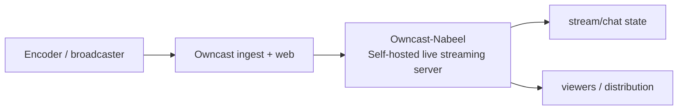
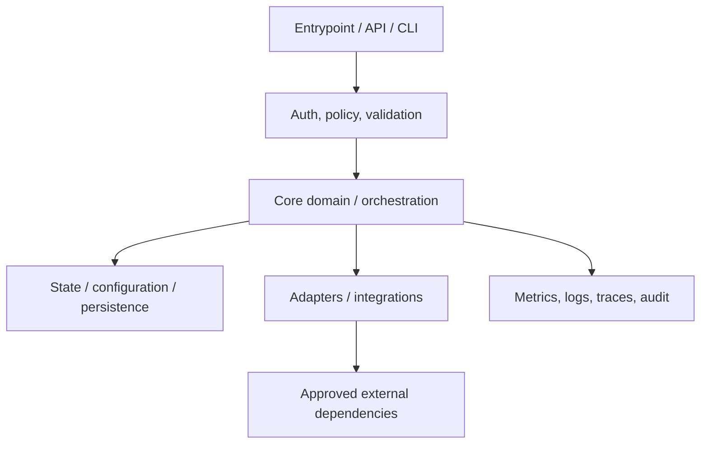
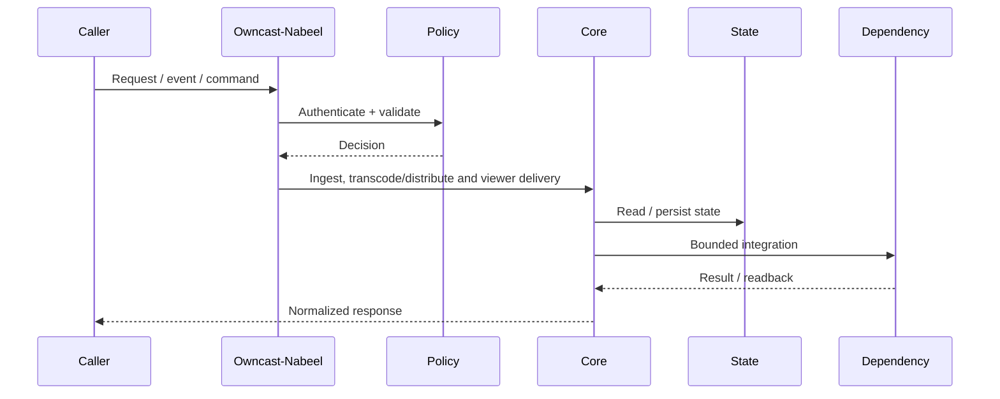
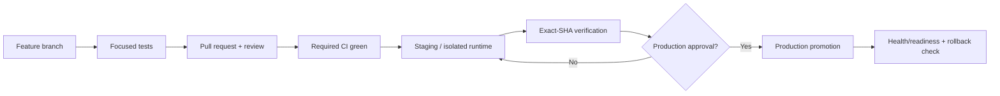
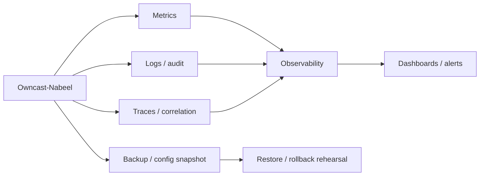

# Owncast-Nabeel — Architecture Charts

> Repository: `appolon1908/Owncast-Nabeel`  
> Baseline branch: `main`  
> Repository-local visual architecture. Update these charts whenever ownership, interfaces, persistence, or deployment changes.

## 1. System context

## 2. Internal architecture

## 3. Critical flow

## 4. Deployment and promotion

## 5. Observability and recovery

## Ownership notes
- **Role:** Self-hosted live streaming server
- **Primary boundary:** Owncast ingest + web
- **State/config:** stream/chat state
- **Dependencies/consumers:** viewers / distribution
- Cross-repository effects must use reviewed contracts; production effects remain separately gated.
